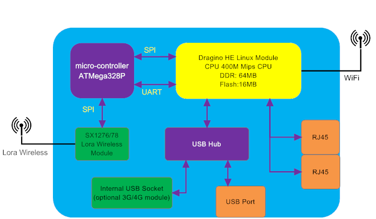
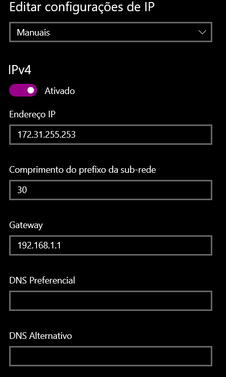

<!-- Alignment options!!!!! -->


# Dragino LG-01

LG01 é um Gateway LoRa open source de canal único utilizado na comunicação deste repositório. A arquitetura desse sistema, como mostra a imagem abaixo, tem como processamento principal um módulo Linux customizado pela Dragino utilizando de um sistema operacional OpenWRT, o qual se comunica via SPI e UART com o micro-controlador ATMEGA328P, responsável em fazer a comunicação com os end-nodes pelo módulo Lora, além de possuir entradas para RJ-45, USB e Wi-fi para conexão com a Internet. Temos então que esse é um dispositivo que possui capacidade de comunicação simples com outros dispositivos que se comuniquem via LoRa, já que opera em apenas um canal e uma parte mais robusta relacionada a sua conexão a rede, podendo ser tanto via dados móveis, wi-fi e cabeado.



## Primeiro Uso
No primeiro uso, é simples fazer a conexão com esse dispositivo, uma vez que ele vai possuir o seu wi-fi liberado para qualquer dispositivo se conectar, ou seja, ele gera uma rede insegura. Após essa conexão o LG01 poderá ser acessado via sua interface web no IP 10.130.1.1 para acessar:

> ``` :bulb: user: root — password: dragino```

É por essa interface web que podes fazer alterações mais gerais de configurações do sistema, sendo as principais:

- Informações gerais de processamento do Gateway
- A escolha do meio para a conexão com a Internet
- Log do sistema em relação ao funcionamento interno e ao envio de pacotes
- Tipo de comunicação que será feito com o servidor (no nosso caso com a plataforma Dojot)

Essa interface web facilita no entendimento geral do sistema e na configuração inicial de conexão à rede, podendo escolher entre conexão wi-fi, cabeada, utilizando de um chip de operadora. Por padrão é escolhido conexão via Wi-Fi, onde os campos de SSID está relacionado ao nome da rede e o password a senha dessa rede, além de precisar se atentar quanto ao tipo de criptografia, no geral a utilizapa é a WPA2 quando não especificado.  Com a conexão a rede configurada e estabelecida, a interface web poderá ser acessada pelo seu IP que será designado pela rede ou fazer acesso via SSH a qual possibilita uma série de personalizações e atualizações pelo usuário.

Há diversas formas de adiquirir um IP de um dispositivo conectado a rede, vou citar algumas aqui:
+ Verificar diretamente o IP no modem, procurando os dispositivos conectados; (Se o LG01 tiver conectado a um HotSpot ainda é válido o que está dito nesse tópico)
+ Utilizar da conexão de dispositivo de rede da própria Arduino IDE para verificar o IP;
+ No Ubuntu utilizar do comando ```netstat```, caso não tenha instalado na máquina é só preciso instalar o pacote nettools:
```bash
sudo netstat -sn ip.do.modem.aqui
```

### Dicas para evitar problemas após configurar a interface de rede do LG01
Uma vez que a conexão insegura só está habilitada para o primeiro uso, aqui vai umas dicas para não ter dor de cabeça na hora que for trocar a rede na qual o LG01 vai se conectar:

- Enquanto o LG01 está conectado na rede atual já troque o usuário e a senha do wi-fi para as do local destino que o LG01 vai se conectar, caso não saiba siga o passo abaixo. Caso tenha colocado errado, não se preocupe que o último ponto ajudará justamente nisso.
- Caso não saiba o usuário e a senha do local destino para a conexão, aconselho a utilizar o celular como roteador e deixar configurado o LG01 para se conectar ao celular, o que facilitará bastante na troca de rede do Hardware. Caso tenha errado também o user e a senha do dispositivo móvel siga o próximo passo
- Em casos de emergência, o LG01 possui uma conexão cabeada via RJ-45 para conexão com sua interface web na porta LAN, para isso é preciso configurar o IP de forma manual com endereço: 172.31.255.253 e sub-rede(net-mask) 30 (255.255.255.252) com gateway a sua escolha mas tem o exemplo abaixo de referência, com essa conexão estabelecida a interface web do LG01 poderá ser acessada via IP 172.31.255.254. A imagem abaixo mostra um exemplo dessa configuração.

<!-- Alignment options!!!!! -->
<p align="center">

</p>

- Caso essa solução não funcione também, não tema que ainda há duas formas de acessar o LG01. 
    - Uma delas requer a reinicialização de fábrica do sistema, que seria segurar por volta de 10 segundo o botão toogle para que o sistema seja reiniciado e a conexão insegura via wi-fi fique disponível novamente.
    - A outra, aconselho apenas em último, caso que é seguir esse pequeno passo-a-passo [disponível aqui](https://wiki.dragino.com/index.php?title=Recover_Gateway) que, resumidamente, é fazer o upload de um binário para recuperar o sistema, caso não saiba alterar o IP da máquina, [clique aqui](https://www.tp-link.com/us/support/faq/919/#:~:text=1%20Open%20the%20Control%20Panel%20Press%20%E2%80%9C%20Windows,of%20network%20connection.%204%20Set%20the%20IP%20address). Esse caso também é indicado para caso o firmware não esteja mais funcionando adequandamente.
> Essas reinicializações não afetam o código compilado dentro do ATMEGA328.

## Configurações da Interface Web
Para a estabelecer a comunicação do LG01 com a Dojot é preciso realizar algumas configurações da interface web.
+ ### Sensor>IoT Server
    Nessa página é preciso apenas deixar o campo **IoT Server** com o valor *MQTT*, que é o utilizado para fazer a comunicação. Quanto ao **Log Debug Info** representa o nível de informações que vão ser printadas nas janela de debug, para fins de melhor acompanhamento é melhor deixar no *nível 2* e salvar as alterações
+ ### Sensor>MQTT
    Nessa página é feito as configurações da comunicação via MQTT com a dojot. Há duas seções com ambas precisando ser configuradas. A primeira seção é referente a configuração do MQTT Server, dessa seção nem todos os campos precisam ser preenchidos, só é preciso preencher os campos abaixo:
    + Select Server: General Server
    + Broker Address [-h]: Insira.o.ip.aqui
    + Broker Port [-p]: 1883
    + User Name [-u]: admin:<id_dispositivo_virtual_gateway>
    + Topic Format [-t]: admin:<id_dispositivo_virtual_gateway>/attrs
    + Data String Format [-m]: DATA
    > Pode ser que alguns dos nomes dos campos esteja desatualizado, então se baseie pelo o que está entre [ ]
    
    > O campo com a chave [-m] recebe DATA tudo em caixa alta pois DATA é uma variável de ambiente dentro do LG01 onde fica os valores armazenados dos sensores que ele recebe.

    A segunda seção é referente ao MQTT Channel onde será configurado dois canais para envios de informações. Para isso é preciso criar o primeiro canal, preencher com 123 o campo local channel e o remote channel preencher com o <id_dispositivo_virtual_gateway>, já o segundo canal preencher o local channel com 16a e o remote channel com o <id_dispositivo_virtual_gateway>.
+ ### Sensor>LoRa
    Nessa página vamos fazer as configurações da comunicação via LoRa utilizado pelo LG01. Como não está sendo utilizado a comunicação via protocolo LoRaWAN, a primeira seção será ignorada. A segunda seção vai receber os seguintes valores para cada campo:
    + TX Frequency: 915000000
    + RX Frequency: 915000000
    + Spreading Factor: SF7
    + Transmit Spreading Factor: SF7
    + Coding Rate: 4/5
    + Signal Bandwidth: 125kHz
    Os campos não listados não precisam de alteração, ou podem permanecer vazios.
    >Esses valores podem ser alterados para uma análise de desempenho do canal LoRa mas para fins de comunicação básica com a plataforma foram definidos esses valores.


## Conexão via SSH
Uma conexão simples via SSH não é possível com o LG01 por causa do uso de protocolos antigos na troca das keys para conexão via SSH[^1].Primeiramente é preciso saber o IP que o LG01 está utilizando, com o IP em mãos o comando para conexão via SSH é o seguinte:

```
ssh -oKexAlgorithms=+diffie-hellman-group1-sha1 root@insira.o.ip.aqui
```

+ ### Pós acesso via SSH ao LG01
O LG01 possui o sistema operacional OpenWRT que, como o nome indica, é um SO opensource, umas dicas de navegação simples estão disponíveis [aqui](../cheatsheet/cheatsheet-linux.pdf). Além disso, caso queira saber mais como utilizar de linux indico a site Guia Foca[^2]. No primeiro uso do dispositivo é uma boa prática atualizar seu sistema e os pacotes que ele utiliza, para isso:

```
opkg update
opkg list
opkg install mosquitto-client
```
Esses comandos são tanto para atualizar os pacotes utilizados no sistema, listar o que estão de uso e instalar o mosquitto-client. Para mais informações, acesse [aqui](https://oldwiki.archive.openwrt.org/doc/techref/opkg).

Além disso há também a possibilidade de atualizar o firmware do LG01, o firmware mais atualizado fica disponível em [Dragino Download Server](https://www.dragino.com/downloads/index.php?dir=motherboards/ms14/Firmware/IoT/) com a versão atualmente instalada atualmente sendo a v4.3.6. Para instalar o firmware disponível pode ser tanto utilizado a interface web (Web>System>Back Up and flash firmware) quanto a utilização de linha de comando, primeiramente enviando o arquivo via scp e depois executando o comando:

```
/sbin/sysupgrade -n /var/Your_Imag
```

[^1]: Solução retirada de: https://www.infosecmatter.com/solution-for-ssh-unable-to-negotiate-errors/

[^2]: https://guiafoca.org/

+ ### Localizando e configurando os scripts IoT
Acessando o gateway via SSH é possível verificar várias de suas configurações assim como o que está sendo salvo dentro dela. No instante que você escolhe qual a comunicação IoT vai ser utilizada pelo LG01 é o momento que ele escolhe o script que vai utilizar para tal função. No diretório ``` /etc/iot/scripts ``` está todos os scripts que o Gateway utiliza para os diferentes tipos de comunicação de acordo com o protocolo escolhido (HTTP/LoRaWAN/MQTT). Para realização da comunicação com a plataforma Dojot é necessário ter escolhido a opção MQTT em Sensor > IoT Server, isso fará com que o script ativo seja o [mqtt_process.sh](iot-scripts/mqtt_process_default.sh).

Analisando o fluxo desse código, é possível resumi-lo em:
+ Declaração de variáveis de acordo com o que foi definido na interface web. 
    + Ex.: O comando ```uci get mqtt.general.port``` retorna a porta que foi configurada na página Sensor > MQTT
    > Lembrando que é preciso utilizar esses comandos dentro do LG-01, ou seja, acessando-o via SSH
+ Utilização de DEBUG de acordo com o que foi definido na página Sensor>Iot Server com o seu print disponível na página de LOG
+ Loop em que é verificado se há conteúdo novo dentro do diretório channels após um dado intervalo de tempo, para que então seja possível enviar esse conteúdo via ```mosquitto_pub```. Após enviado esse conteúdo é deletado e o ciclo recomeça.

Com isso definido, não há muito o que modificar dentro desse script já que as informações das variáveis vem da interface web. Se for necessário enviar as informações das coletas para outro servidor além do cadastrado só é preciso adicionar a linha de código abaixo configurada para o servidor de destino, para alterar esse script é preciso utilizar do editor de texto nativo [vim](../cheatsheet/cheatsheet-vim.pdf) e adicionar a linha de código abaixo abaixo do comentário ```### Send MQTT Command```.

```
mosquitto_pub -h $server -p $port -u $user -P $pass -i $clientID -t $topic -m $mqtt_data
```
> Vale ressaltar que qualquer alteração em scripts dentro da pasta iot, é preciso reiniciar o sistema para que as alterações comecem a ser levadas em consideração;

### Comunicação teste com a Dojot

A seção anterior mostrou como que é feito o envio automatizado dos pacotes pelo script [mqtt_process.sh](iot-scripts/mqtt_process_default.sh). No entanto, antes de utilizar desse script é bom verificar se há comunicação entre o LG01 e a plataforma Dojot. Para isso é preciso utilizar do mesmo comando que é utilizado no script para envio, só que utilizando somente o necessário:

```
mosquitto_pub -h insira.o.ip.aqui -p 1883 -u admin:<id_dispositivo_virtual> -t admin:<id_dispositivo_virtual>/attrs -m '{"pd":{"i":"74d495","t":27.5,"u":83.0,"x":0,"s":48.0,"l":324.0,"rssi":-36}}'
```

Esse comando faz o envio via MQTT para a plataforma Dojot configurando os campos de IP (```-h```), porta (```-p```) sendo por padrão a utilizada a não segura 1883, o usuário da plataforma (```-u```), o tenancy (```-t```) e o pacote a ser enviado (```-m```), sendo nesse caso o pacote enviado um JSON com o nome da variável cadastrada na plataforma ```pd```. O comando utiliza somente desses campos pois a documentação da plataforma indica que isso é o suficiente para o envio, sendo que os campos de usuário e tenancy precisam seguir, respectivamente: ```admin:<id_dispositivo_virtual>``` e ```admin:<id_dispositivo_virtual>/attrs```.

Acessando a documentação do comando é possível ver com detalhes o que são cada uma dessas configurações.

Para o desenvolvimento dessa documentação foi utilizado o dragino-starter-kit v1, mais detalhes quanto às informações do equipamento deixo disponível a [documentação](pdf/LG01_LoRa_Gateway_User_Manual.pdf) em pdf disponibilizada pela própria dragino.

Algumas outras referências utilizadas e possíveis de serem utilizadas:
1. https://wiki.dragino.com/index.php?title=Main_Page
2. https://www.wiki.dragino.com/index.php?title=Through_MQTT_to_upload_data
3. https://wiki.dragino.com/index.php?title=TCP_Connection_Instruction
4. https://wiki.dragino.com/index.php?title=Examples_Catalog
5. https://wiki.dragino.com/index.php?title=Mesh_IoT_Firmware

Hex to Char
1. https://www.rapidtables.com/convert/number/hex-to-ascii.html#:~:text=Hex%20to%20ASCII%20text%20conversion%20table%20%20,%20%20ETX%20%20124%20more%20rows%20
2. https://calculareconverter.com.br/hex-to-ascii/

Biblioteca RadioHead
1. https://github.com/dragino/RadioHead/blob/master/RH_RF95.h
2. https://github.com/dragino/RadioHead/blob/master/RH_RF95.cpp

https://github.com/dragino/Arduino-Profile-Examples/blob/master/libraries/Dragino/examples/LoRa/LoRaWAN/single_pkt_fwd_v003/single_pkt_fwd_v003.ino
https://github.com/dragino/Arduino-Profile-Examples/blob/master/libraries/Dragino/examples/LoRa/MQTT_Simple_Server/MQTT_Simple_Server.ino
